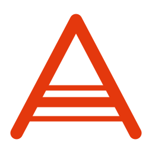

<p align="center">
  
</p>

<h1 align="center">ÁLETRA</h1>

<p align="center">
  <b>A</b>tlas, <b>L</b>evantamento e <b>E</b>xterior de <b>T</b>angentes em
  <b>R</b>enderização <b>A</b>nimada
</p>

Geometria diferencial que se lê como contagem.

Uma one-form ω é desenhada como uma pilha de folhas. Um vetor v é uma seta. E o
valor ⟨ω, v⟩ é literalmente **quantas folhas a seta atravessa** — o número na
tela e a imagem são a mesma leitura, não dois fatos que o aluno precisa
reconciliar.

**[Abrir no navegador →](https://rafaelcrdelima.github.io/ALETRA/)**

Não instala nada, não envia nada para servidor nenhum: a página é estática e
toda a geometria é calculada na aba aberta, na máquina de quem abriu.

## O que já funciona

- **Oito superfícies**: esfera, toro, cilindro, cone, fita de Möbius, plano
  euclidiano, plano hiperbólico e a fatia equatorial de Schwarzschild — ou
  qualquer métrica que você digitar nos campos `g_ij`. Seis delas têm mergulho
  em ℝ³ desenhado ao lado da carta.
- **O funil de Schwarzschild**, que é o paraboloide de Flamm: não uma ilustração
  de buraco negro, e sim a métrica digitada nos campos, isometricamente
  mergulhada. Cada círculo tem raio r, mas a distância entre dois vizinhos é
  maior que Δr — e o funil acaba no horizonte, onde a carta segue sozinha.
- **Os três sinais de curvatura**, alcançáveis arrastando: o cilindro e o cone
  são planos por dentro embora entortem no espaço; o toro tem K > 0 por fora,
  K < 0 por dentro e K = 0 nos círculos de cima e de baixo, tudo na mesma
  superfície.
- **Uma superfície que a carta não consegue descrever**: a fita de Möbius. A
  métrica dela vive num retângulo, que é orientável; a fita não é. A torção
  está na colagem das bordas, e só o painel de ℝ³ sabe dela.
- **Dois painéis sincronizados**: a carta de coordenadas e, quando existe, o
  mergulho em ℝ³. Arrastar num move o outro. As duas imagens discordam — o
  número não.
- **Regiões onde a carta falha** aparecem hachuradas, com o arraste bloqueado e
  uma mensagem que distingue singularidade de coordenada (o horizonte em r=2M,
  os polos da esfera) de singularidade de curvatura real (r=0).

## Compartilhar uma cena

O botão **copiar link** guarda a cena inteira no endereço — métrica digitada, ponto, vetor, ω e a
morfose de ♭. Quem abrir o link vê exatamente o que você via. Nada é enviado a servidor nenhum: o
estado viaja no próprio endereço, e as cenas do escopo cabem em menos de 600 caracteres.

## Modo cena-limpa

Acrescente `?limpo=1` ao endereço e todo o cromo desaparece: fica a superfície,
o vetor, a pilha e o número. É a configuração para mostrar a alguém sem
explicação prévia — nada na tela compete com a leitura. `?exemplo=toro`,
`?exemplo=cone` ou `?exemplo=schwarzschild` escolhem a superfície.

[Ver o modo limpo →](https://rafaelcrdelima.github.io/ALETRA/?limpo=1)

Todas as seis leituras existem nos **dois painéis**: na carta e, quando a
superfície tem mergulho conhecido, desenhadas sobre ela em ℝ³. As seis leituras
do seletor: contar folhas ⟨ω,v⟩, contar células (ω∧η)(u,v),
circulação dω(u,v) com d²=0 colapsando na tela, o vão dos fluxos [X,Y],
holonomia (onde o ângulo **é** a área cercada) e geodésicas com desvio
geodésico. O caminho está em [PLAN.md](PLAN.md), e
o porquê de cada escolha técnica em [DECISIONS.md](DECISIONS.md).

## Desenvolvimento

```bash
pnpm install
pnpm dev         # servidor local
pnpm test        # suíte do núcleo numérico
pnpm build       # typecheck + build de produção em dist/
pnpm verificar   # captura as cenas no navegador (precisa do dev no ar)
```

`core/` é matemática pura, sem DOM nem WebGL, e é a única camada com testes
automatizados — os casos de verificação são superfícies com resposta fechada
conhecida (curvatura constante, Christoffels analíticos). `render/` desenha o
que `core/` calcula, e `app/` cuida do estado e da interação.

## Licença

Ainda não definida.
